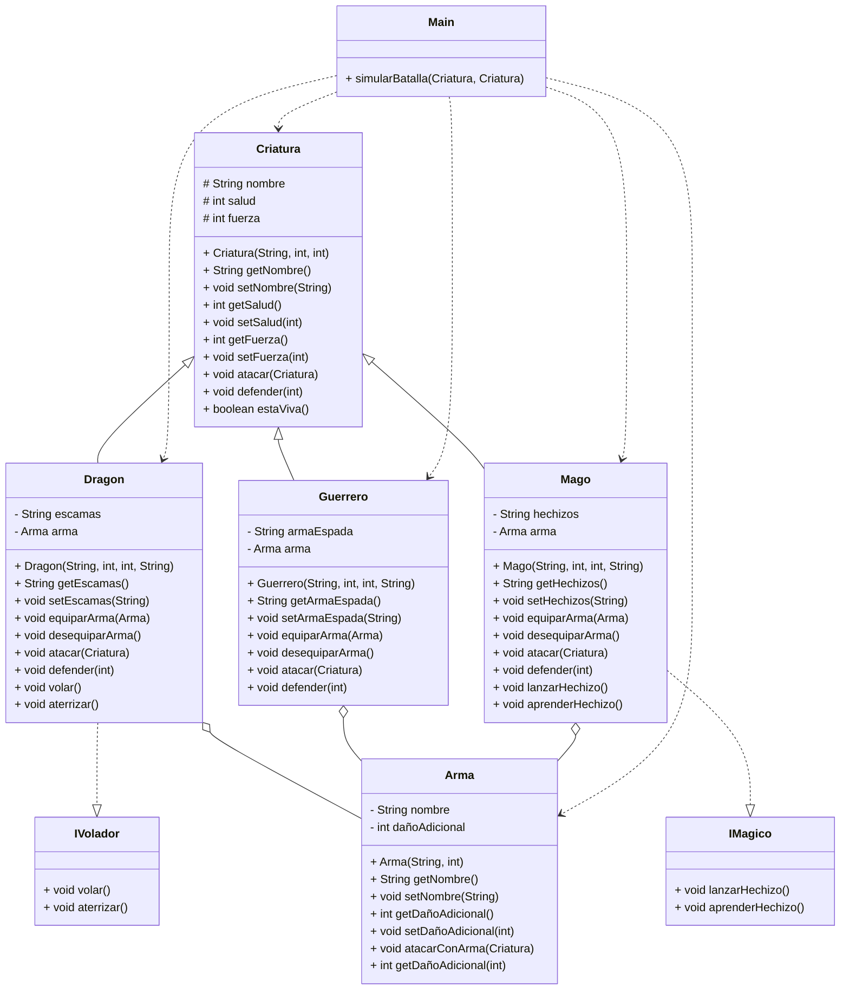

# Parcial II - Parte práctica G412

Se requiere implementar un sistema de juego de batallas entre diferentes criaturas
utilizando polimorfismo, clases abstractas, interfaces y composición. Cada criatura debe
tener sus propias características y habilidades únicas.

## Integrantes:
- **Jean Paul Rojas Herrera**
- **Michael Dowglas Lenis Chaguendo**

### Diagrama de Clases:

## Decisiones de diseño

### 1. Clase Abstracta `Criatura`
Se decidió usar una clase abstracta en lugar de una interfaz para `Criatura`
porque todas las criaturas comparten atributos comunes (`nombre`, `salud`,
`fuerza`) y un método concreto (`estaViva()`). Una interfaz no permite
definir atributos con estado, por lo que la clase abstracta fue la opción
más adecuada para representar esta base común.

Los métodos `atacar()` y `defender()` se definieron como abstractos porque
cada criatura tiene su propia forma de atacar y defenderse, por lo que no
tiene sentido definir una implementación genérica en la clase padre.

### 2. Interfaces `IVolador` e `IMagico`
Se usaron interfaces para representar habilidades específicas que no todas
las criaturas comparten. Esto permite que una clase pueda implementar
múltiples habilidades sin depender de la jerarquía de herencia, respetando
el principio de segregación de interfaces.

- `IVolador` → implementada por `Dragon`, ya que los dragones pueden volar
y aterrizar.
- `IMagico` → implementada por `Mago`, ya que los magos tienen habilidades
mágicas como lanzar y aprender hechizos.

> Esta decisión permite que en el futuro se puedan agregar nuevas criaturas
que implementen una, ambas, o ninguna de estas interfaces sin modificar
la jerarquía existente.

### 3. Composición con la clase `Arma`
Se decidió usar composición en lugar de herencia para las armas porque un
arma es algo que una criatura **tiene**, no algo que una criatura **es**.
Usar herencia hubiera generado una jerarquía innecesaria y rígida.

### 4. Clases Concretas `Dragon`, `Mago` y `Guerrero`
Cada clase concreta implementa los métodos abstractos de `Criatura` según
sus características propias:

- **Dragon**: ataca con el doble de su fuerza (`fuerza * 2`) y sus escamas
reducen el daño recibido a la mitad, representando su resistencia natural.
Implementa `IVolador` por su capacidad de volar.

- **Mago**: ataca con hechizos usando su fuerza base. Implementa `IMagico`
por sus habilidades mágicas. Su defensa no tiene reducción de daño adicional
ya que no tiene armadura física.

- **Guerrero**: ataca con su espada usando su fuerza base. No implementa
ninguna interfaz adicional ya que sus habilidades son puramente físicas.
Puede equipar armas para aumentar su poder de ataque.

### 5. Método `simularBatalla()` en `Main`
Se definió como un método estático en `Main` porque no pertenece a ninguna
criatura en particular sino que coordina la interacción entre dos criaturas.
Dentro del método se usa `instanceof` para verificar si una criatura tiene
habilidades especiales (`IVolador` o `IMagico`) y ejecutarlas antes de cada
ataque, reflejando el uso de polimorfismo en tiempo de ejecución.

## Pruebas Unitarias con JUnit 5

Se implementaron pruebas unitarias para verificar los comportamientos más
críticos del sistema, como la reducción de salud al recibir daño, que la
salud nunca sea negativa, y que el sistema detecte correctamente cuándo
una criatura ha muerto. Se usó `@BeforeEach` para inicializar los objetos
antes de cada prueba, garantizando que cada test sea independiente.

## Instrucciones de uso

1. Clona el repositorio.
2. Navega a cada directorio de ejercicios.
3. Compila y ejecuta el archivo `Main.java` para probar el ejercicio.
4. Ejecuta el comando `mvn test` en la terminal bash para inicializar las pruebas unitarias.